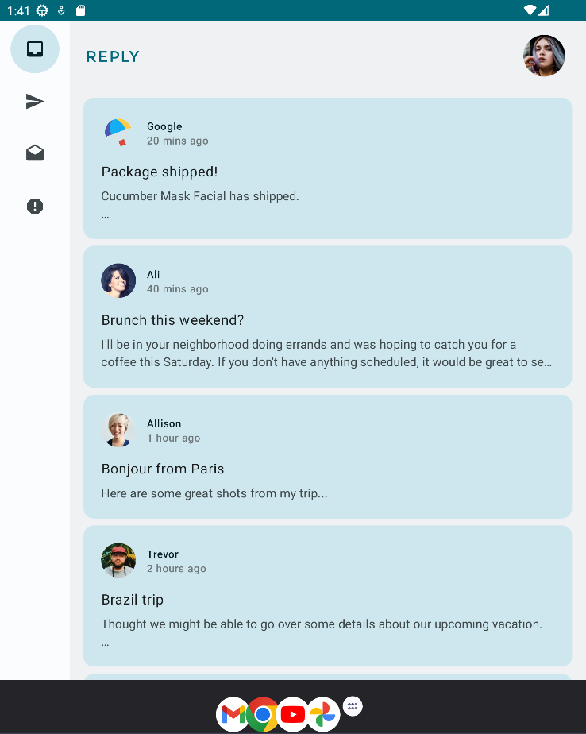

Reply App - Starter Code
=================================

The Reply app is a basic email client that displays various categories of your
inbox. This app is used to illustrate the concept of adaptive layouts.

It's developed using Jetpack Compose components like ```Column```, ```Button```, ```Text```, ```Image```, and ```Modifier```.

<p align="center">
  
  
  
</p>

Getting Started
---------------

1. Install Android Studio, if you don't already have it.
2. Download the sample.
3. Import the sample into Android Studio.
4. Build and run the sample.
